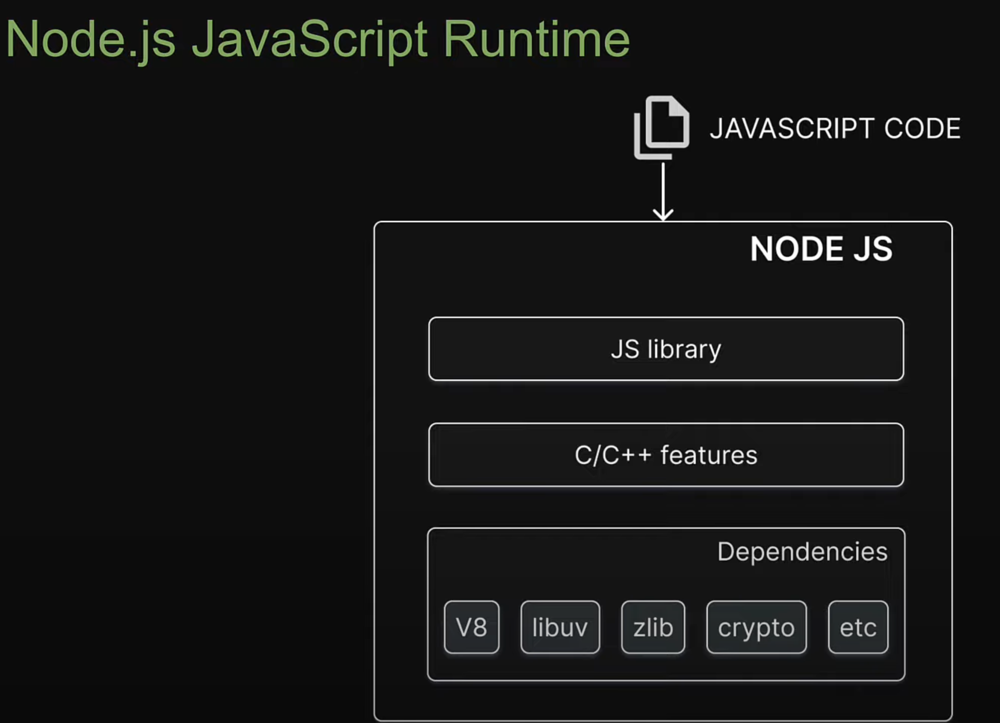

# Javascript (ECMA)

- 1995 Netscape created a new scripting language called javascript
- The standard for setting specifications in JS is ECMA-262 (European computer manufacture association)
- Commmitte for this is known as Technical committe (TC39)
- JS is offically known as ECMAscript as Oracle owns trademark for JS
- ES6 (2015) -> Modern JS

## Javascript engine

- Converts JS to machine code. Ex. V8 (V8.dev), Spidermonkey, JS core.
- V8 engine (2008) is written in C++. We can embedd V8 in any C++ program. T
- This allows to do everything V8 does + add additional functionalities (Such as fs, networking). Nodejs is one such C++ program, which embedds V8.

## Nodejs (2009)

- Node.js is javascript runtime environment. It allows a JS to run outside of a browser. A runtime is JS Engine(V8) + Web/Node(C++) APIs + Event loop

  

  

### Node js engine consits of

- deps : External dependencies such as V8
- src : C/C++ features such as file system and networking
- lib : JS library to access C++ features
